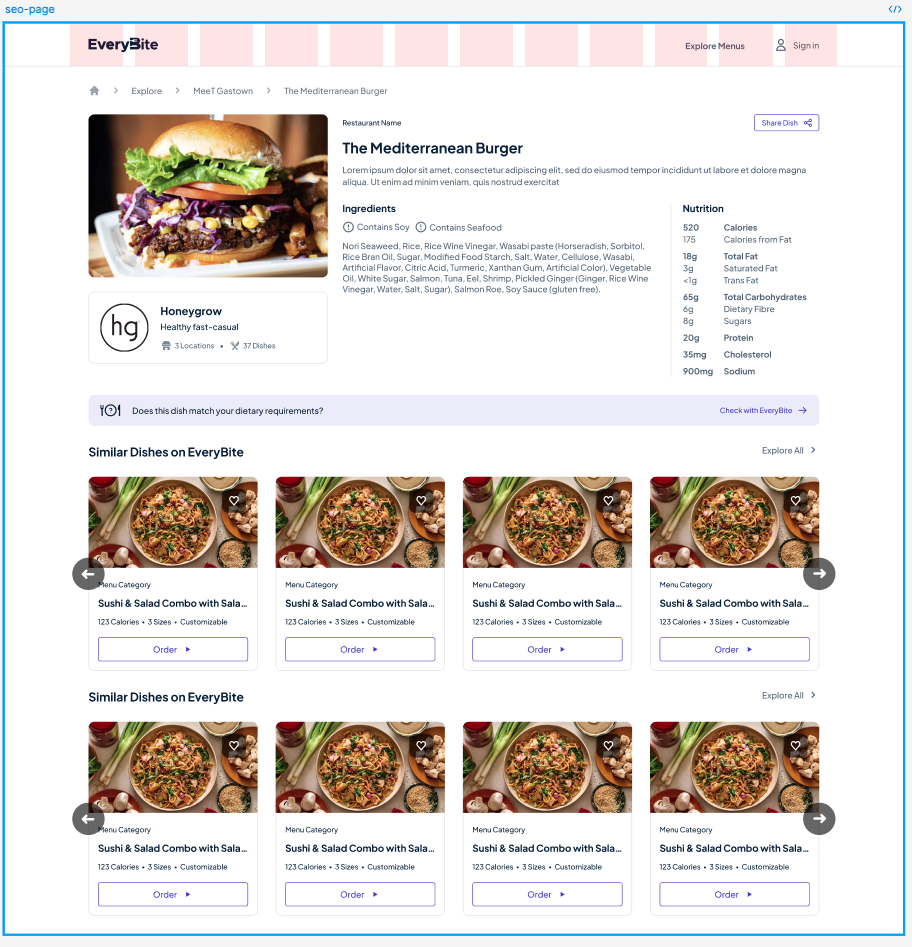

# Figma ↔ Tailwind Reference


*Reference Screenshot: SEO Dish Detail Page*

This file is for mapping Figma design specs to Tailwind CSS classes and JSX usage in this project. Add code snippets, screenshots, or Figma Inspect data for each component below. This will serve as the single source of truth for UI scaling, spacing, and styling.

---

## How to Use
- For each component or image, paste the relevant Figma frame/component link, screenshot, or Inspect panel data.
- Add the corresponding JSX/Tailwind code used in the project.
- I will reference this file for all future scaling, sizing, and style decisions.

---

## Example Entry

### Dish Detail Card Image
- **Figma Reference:** [Paste link or screenshot here]
- **Figma Specs:**
  - Size: 320×180px
  - Border radius: 12px
  - Object fit: Cover
- **Tailwind/JSX:**
  ```jsx
  <div className="relative w-full aspect-[16/9] rounded-[12px] overflow-hidden">
    <DishImage src={image} alt={name} className="absolute inset-0 w-full h-full object-cover rounded-[12px]" />
  </div>
  ```

---

## Components

### 1. Main Page Container
- **Figma Reference:** _(add frame link or screenshot)_
- **Figma Specs:**
  - Width: 1500px
  - Background: white
  - Layout: vertical (column), centered
- **Tailwind/JSX:**
  ```jsx
  <div className="w-[1500px] bg-white inline-flex flex-col justify-start items-center">
    {/* ... */}
  </div>
  ```

### 2. Header Bar
- **Figma Reference:** _(add frame link or screenshot)_
- **Figma Specs:**
  - Height: 64px (h-16)
  - Padding: px-8 (left/right), px-7 (logo area)
  - Background: white
  - Box shadow: 0px 0px 33px 0px rgba(0,0,0,0.13)
  - Border bottom: 1px, zinc-200
  - Layout: horizontal, spaced between
- **Tailwind/JSX:**
  ```jsx
  <div className="self-stretch h-16 px-8 bg-white shadow-[0px_0px_33px_0px_rgba(0,0,0,0.13)] border-b border-zinc-200 inline-flex justify-between items-center">
    {/* ... */}
  </div>
  ```

### 3. Logo/Icon Area
- **Figma Reference:** _(add frame link or screenshot)_
- **Figma Specs:**
  - Height: 24px (h-6)
  - Layout: vertical stack, gap 2.5
  - Contains SVG icons (see below)
- **Tailwind/JSX:**
  ```jsx
  <div className="h-6 inline-flex flex-col justify-start items-start gap-2.5">
    {/* SVG icons here */}
  </div>
  ```

#### 3a. Full JSX Example — Header Logo/Icon Area
<details>
<summary>Expand for complete JSX with SVGs</summary>

```jsx
<div className="w-[1500px] bg-white inline-flex flex-col justify-start items-center">
  <div className="self-stretch h-16 px-8 bg-white shadow-[0px_0px_33px_0px_rgba(0,0,0,0.13)] border-b border-zinc-200 inline-flex justify-between items-center">
    <div className="flex-1 h-16 max-w-[1280px] px-7 py-3 flex justify-start items-center gap-10">
      <div className="h-6 inline-flex flex-col justify-start items-start gap-2.5">
        {/* SVG icon wrappers and SVGs go here. See below for full SVGs. */}
        <div data-svg-wrapper>
          <svg width="14" height="19" viewBox="0 0 14 19" fill="none" xmlns="http://www.w3.org/2000/svg">
            <path d="M0.301309 0.863747H0V18.5289H13.7637V18.2281V14.9248V14.6238H13.4623H4.28477V11.4749H12.5667H12.8681V11.1741V7.87062V7.56983H12.5667H4.28477V4.76865H13.4623H13.7637V4.46786V1.16453V0.863747H13.4623H0.301309Z" fill="#071D3B"/>
          </svg>
        </div>
        {/* ...repeat for all SVGs (see your full block for details)... */}
      </div>
    </div>
  </div>
</div>
```

<!-- For brevity, only one SVG is shown above. Paste your full SVG block here for complete reference. -->

</details>

### 4. SVG Icons
- **Figma Reference:** _(add frame link or screenshot)_
- **Figma Specs:**
  - Provided as inline SVGs, various sizes (see HTML for details)
  - Fill: #071D3B
- **Tailwind/JSX:**
  ```jsx
  <svg width="14" height="19" ... >...</svg>
  <!-- Repeat for each icon as needed -->
  ```

### 5. Any Other Component
- **Figma Reference:**
- **Figma Specs:**
- **Tailwind/JSX:**

---

> Add new entries as needed. This file will be referenced for all future UI scaling and styling decisions.
